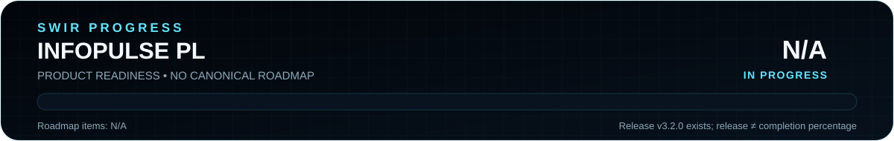

<!-- SWIR-README-STANDARD:v2 -->

<div align="center">


# InfoPulse PL

**A Polish desktop dashboard that combines RSS, public APIs and optional text-input automation.**


[](https://github.com/Swir)
[](https://github.com/Swir/InfoPulse-PL/stargazers)

[**Highlights**](#-highlights) · [**Quick Start**](#-quick-start) · [**Sources**](#-data-sources--custom-sources) · [**Safety**](#-automation--responsible-use) · [**Release**](#-progress--release-status)

</div>


## 📍 Project Status

| Item | Current state |
|---|---|
| Application | InfoPulse PL `v3.2 MAX` source line |
| Interface | Polish CustomTkinter desktop UI |
| Primary platform | Windows; public x64 package available |
| Latest public release | [`v3.2.0`](https://github.com/Swir/InfoPulse-PL/releases/tag/v3.2.0) |
| Product progress | **N/A** — no canonical measurable roadmap exists |

<p align="center">
  
</p>

The public release and product-completion progress are intentionally separate. Without a reproducible roadmap denominator, this repository does not invent a completion percentage. See [verification notes](docs/README-VERIFICATION.md).

## 🚀 Overview

**InfoPulse PL** collects short information items from RSS/Atom feeds and public JSON APIs, presents them in a Polish desktop dashboard and can combine selected items into outgoing text. It includes built-in information modules plus user-configurable RSS/Atom and JSON GET sources.

The optional input-automation workflow can type or paste the generated text into the **currently active field**. That feature requires deliberate focus on the intended destination and should only be used where automated posting/input is permitted.

## ✨ Highlights

| Area | Current capability |
|---|---|
| 📰 News & tech | RSS/API-based news and technology sources, including Polish feeds and Hacker News. |
| 🌦️ Weather & environment | Open-Meteo weather plus air-quality/UV-related modules for Polish regions. |
| 💱 Markets | NBP currency rates and selected cryptocurrency prices from Binance endpoints. |
| 🚀 Space & Earth | NASA RSS, ISS position and USGS earthquake information. |
| 🎮 Other live data | Free-game and knowledge/status modules where their upstream endpoints are available. |
| ➕ Custom sources | User-defined RSS, Atom and JSON GET sources with configurable labels and optional HTTP headers. |
| 🎛️ Source controls | Individual source enable/disable controls and local configuration storage. |
| ⌨️ Optional input automation | Pynput/direct Unicode/clipboard-style workflows for the active text field. |
| 🌙 Desktop dashboard | Dark CustomTkinter interface with activity/status information. |

External services are independent dependencies. A feature being present in the source does not guarantee that every upstream API/feed is currently reachable or unchanged.

## ⚙️ Quick Start

### Recommended — Windows release

The existing [`v3.2.0`](https://github.com/Swir/InfoPulse-PL/releases/tag/v3.2.0) release provides:

- `InfoPulse-PL.exe`;
- `InfoPulse-PL-v3.2.0-Windows-x64.zip`;
- a SHA-256 sidecar for the ZIP.

Download from the GitHub Release page and keep the checksum sidecar if you want to verify the archive locally.

### From source

```bash
git clone https://github.com/Swir/InfoPulse-PL.git
cd InfoPulse-PL
python -m pip install -r requirements.txt
python InfoPulse_PL.py
```

The README's documented source target is Python **3.10+**. The current Windows release workflow explicitly builds with Python **3.11** and validates `InfoPulse_PL.py` before PyInstaller packaging.

## 📋 Requirements / Compatibility

- Windows-oriented desktop environment for the intended GUI/input-automation workflow.
- Python 3.10+ when running from source; release CI uses Python 3.11.
- Network access for live RSS/API modules.
- Dependencies from [`requirements.txt`](requirements.txt): `requests`, `customtkinter`, `pyautogui`, `pyperclip`, `keyboard` and `pynput`.

The public release is explicitly packaged as **Windows x64**. This migration does not claim equivalent packaged support for Linux or macOS.

## 🌐 Data Sources & Custom Sources

The current source includes modules using services/feeds such as Google News, RMF24, Niebezpiecznik, Antyweb, Hacker News, Ars Technica, Open-Meteo, NBP, Binance, NASA, Wikipedia, USGS, GamerPower and public service-status endpoints.

Custom sources let the user configure RSS/Atom feeds or JSON GET endpoints, including an optional JSON path and optional request headers. If a source requires an API key, keep that secret out of the repository and out of screenshots/logs.

Because these are third-party services, formats, rate limits, URLs and availability can change independently of InfoPulse PL.

## ⌨️ Automation & Responsible Use

InfoPulse PL can send generated text through keyboard/input helpers. Treat this as **local user-directed automation**, not an unattended broadcast system:

1. Select and verify the intended application/text field before enabling automated input.
2. Use reasonable intervals and comply with the destination service's rules.
3. Do not use the program for spam, flooding, unwanted messages or evading platform restrictions.
4. Stop automation before changing focus to another application or sensitive field.
5. Review generated text and external-source accuracy before sending it onward.

The software operates on the active desktop input context, so focus mistakes can send text to the wrong place.

## 🧠 Technology / Architecture

| Layer | Technology / role |
|---|---|
| Main application | [`InfoPulse_PL.py`](InfoPulse_PL.py) |
| GUI | CustomTkinter + Tkinter |
| HTTP / feeds | `requests`, XML parsing, JSON APIs |
| Input automation | pynput, PyAutoGUI, keyboard, Pyperclip |
| Local config | `infopulse_config.json` beside the source/executable location |
| Packaging | PyInstaller Windows one-file/windowed build |
| Release automation | [`.github/workflows/release.yml`](.github/workflows/release.yml) |
| Source assembly | [`.github/workflows/assemble-source.yml`](.github/workflows/assemble-source.yml) for the repository's chunked source transport workflow |

## 📊 Progress & Release Status

<p align="center">
  
</p>

**Product readiness: N/A.** There is no authoritative `ROADMAP.md` or equivalent measurable scope from which a truthful percentage can be calculated. The SVG generator therefore emits N/A and no filled progress segment.

The latest verified public release is **v3.2.0**, published September 12, 2026, with a Windows x64 ZIP, checksum sidecar and standalone EXE. That release status is not presented as a completion percentage.

[**InfoPulse PL v3.2.0 →**](https://github.com/Swir/InfoPulse-PL/releases/tag/v3.2.0) · [**All releases →**](https://github.com/Swir/InfoPulse-PL/releases)

## ⚠️ Limitations / Notes

- The application interface is Polish.
- Live data depends on external APIs/feeds and may fail or change independently.
- Automated text input depends on the active desktop focus.
- No live sweep of every third-party endpoint was performed for this README migration.
- No `LICENSE` file is currently present; this migration does not infer or assign licensing terms.
- This documentation migration does not change source behavior, API endpoints, dependencies, release packages, tags or workflows.

## 🔎 Search Keywords

`InfoPulse PL` • `python information dashboard` • `RSS aggregator Python` • `Atom feed reader` • `JSON API desktop app` • `CustomTkinter dashboard` • `Windows information dashboard` • `Open-Meteo Python` • `Binance API dashboard` • `NBP currency Python` • `public API aggregator` • `custom RSS sources` • `desktop news dashboard` • `local text automation`


<div align="center">


### `COLLECT • REVIEW • PULSE`

**InfoPulse PL — by Swir**

⭐ **If this project is useful, consider leaving a star.**

[**← SWIR profile**](https://github.com/Swir) · [**All projects →**](https://github.com/Swir?tab=repositories) · [**Report an issue**](https://github.com/Swir/InfoPulse-PL/issues)

</div>
